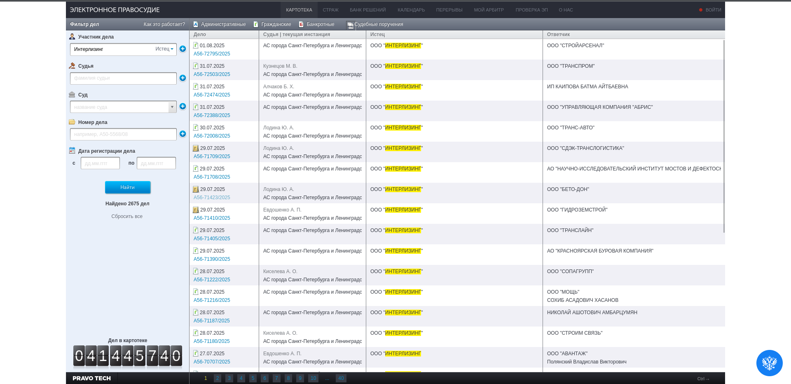
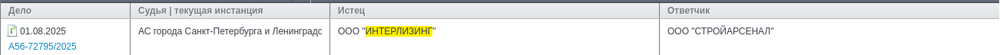
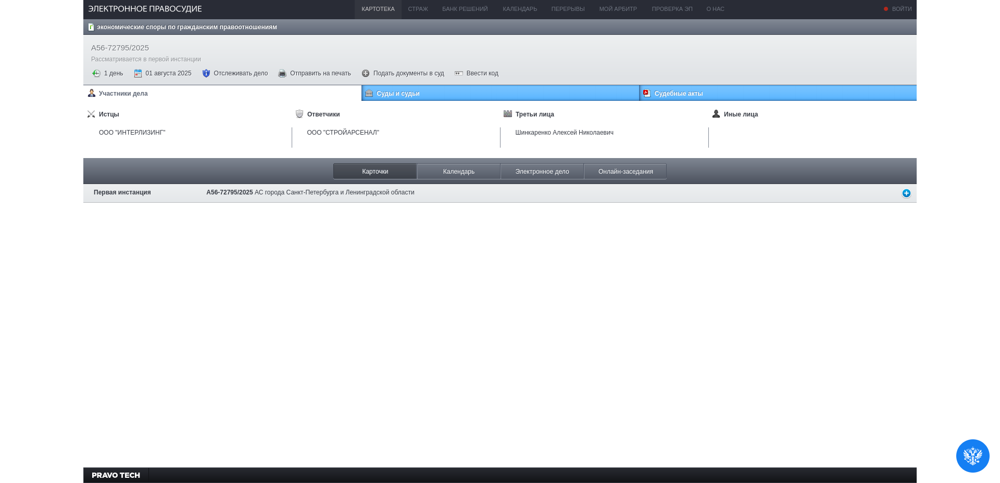
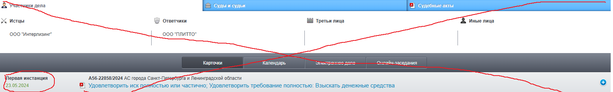
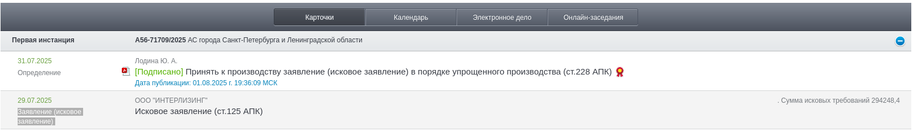
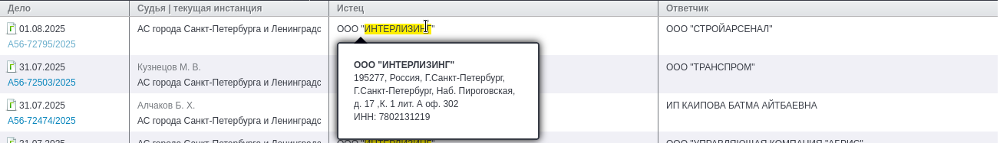
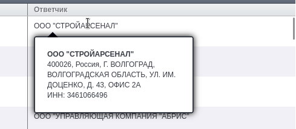
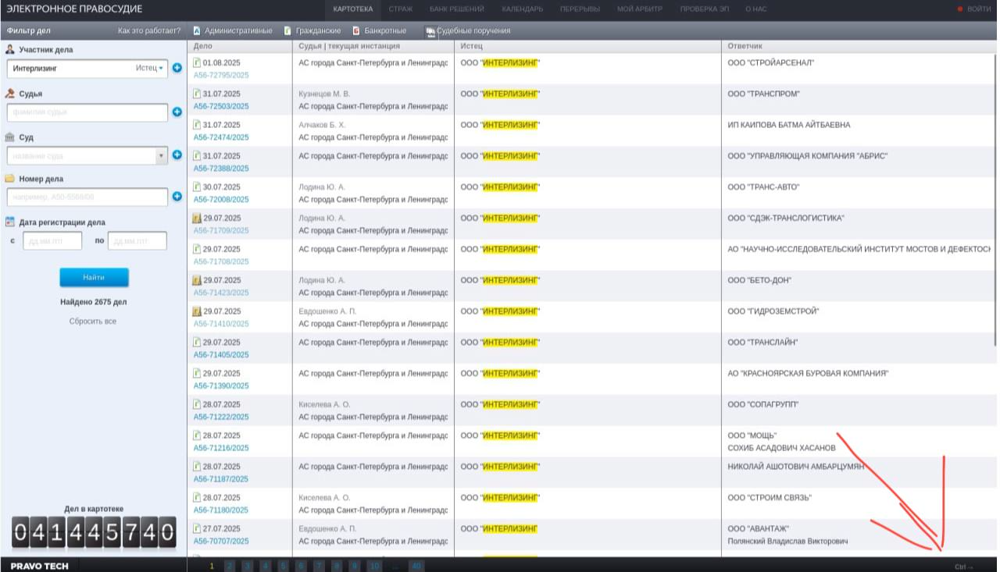

# Парсинг сайта Арбитражного суда
## Входные данные
Скрипту в виде консольных аргументов передаются:
- `--companies-list` - путь к файлу, где через `;` записаны названия/ИНН компаний.
- `--status` - юридический статус. Может равняться "Любой", "Истец", "Ответчик", "Третье лицо", "Иное лицо". Дефолтное значение - "Любой".
- `--start-reg-date` - минимальная дата регистрации. Опциональный аргумент. 
- `--end-reg-date` - максимальная дата регистрации. Опциональный аргумент.
- `--force-recreate` - флаг. если он передан, то программа пересоздаёт выходные файлы даже в том случае, если в них уже есть данные. 

## Выходные данные
- Выходные файлы должны сохраняться в папке **RESULTS**, которая должна быть в корневой папке проекта. **ВНИМАНИЕ!**, пожалуйста, убедитесь, что RESULTS создаётся именно в корневой папке проекта. Используйте относительный путь запускаемого скрипта, что-то типа: `os.path.join(os.path.dirname(os.path.abspath(__file__)), "RESULTS")`. 
- Внутри папки должны создаваться .csv файлы. Название файла должно выглядить так: `arbitr_COMPANY_STATUS_START_END.csv`, где:  
  - COMPANY - ИНН/название компании (из [companies-list](#входные-данные))
  - STATUS - выбранный [status](#входные-данные)
  - START - [start-reg-date](#входные-данные) или "" (если не задан)
  - END - [end-reg-date](#входные-данные) или "" (если не задан)
- Колонки внутри `.csv` файла:
  - адрес страницы
  - дата регистрации искового заявления в арбитражном суде
  - сумма исковых требований
  - Ответчик
  - ИНН ответчика
  - Адрес юрлица (ответчика)
  - Истец
  - ИНН истца

## Процесс работы
1. Скрипт открывает сайт арбитражного суда https://kad.arbitr.ru/
2. Скрипт забивает неизменяемые параметры
   1. Юридический статус ([status](#входные-данные)) dropdown список в поле "Участник дела"
   2. Минимальная дата регистрации ([start-reg-date](#входные-данные))
   3. Максимальная дата регистрации ([end-reg-date](#входные-данные))
3. Скрипт забивает компанию из [companies-list](#входные-данные) в поле "Участник дела"

    

4. Затем скрипт нажимает на кнопку "Найти"
5. После этого должны прогрузиться записи (не забудьте добавить timeout, ведь записи прогружаются не сразу).

    

6. Если записей не появилось, то скрипт сохраняет пустой файл и возвращается к пункту 3 (следующая комания)

7. Далее скрипт поочерёдно обрабатывает строки. Каждая строка обрабатывается следующим образом:
   
   
   
    1. В новой вкладке открывает ссылку из столбца "Дело".

        

    2. Скрипт проверяет, что под "Первая инстанция" нету даты. Если дата есть, то требуется закрыть вкладку и перейти к обработке следующей строки таблицы.

        - Пример, где есть дата:
        
            
        
        - Пример, где нет даты:

            

    3. Скрипт нажимает на кнопку с плюсом

    4. Скрипт ждёт, пока информация прогрузится. Это очень важно, пожалуйста, обратите на это внимание, не забывайте добавлять timeout'ы!

    5. Скрипт сохраняет `дату регистрации искового заявления в арбитражном суде` и `сумма исковых требований`. Обратите внимание, что эти данные нужно взять именно из строки (которых может быть несколько), где в первом столбце написано "Заявление (исковое заявление)". 
       - В [данном примере](https://kad.arbitr.ru/Card/013f35a9-8a07-4202-9743-cc2fd34dd919) `дата регистрации искового заявления в арбитражном суде` равна "29.07.2025", а `сумма исковых требований` равна "294248,4".

            
    

    6. Скрипт сохраняет `адрес страницы` (текущей)
    7. Скрипт закрывает вкладку с делом и переходит обратно на страницу с таблицей.
    8. Скрипт должен извлечь информацию из поля "Истец" 
        - В данном примере
          - `Истец` = ООО "ИНТЕРЛИЗИНГ"
          - `ИНН истца` = 7802131219
            
            

    9. Скрипт должен извлечь информацию из поля "Ответчик"
        - В данном примере 
          - `Ответчик` = ООО "СТРОЙАРСЕНАЛ"
          - `ИНН ответчика` = 3461066496      
          - `Адрес юрлица (ответчика)` = 400026, Россия, Г. ВОЛГОГРАД, ВОЛГОГРАДСКАЯ ОБЛАСТЬ, УЛ. ИМ. ДОЦЕНКО, Д. 43, ОФИС 2А

            
    
    10. Собранную информацию скрипт записывает в выходной файл
8. После обработки всех строк на странице нужно перейти к обработке следующей страницы. Это можно сделать за счёт нажатия кнопки "Ctrl->" в правом нижнем углу.

    

9. После того, как все страницы обработаны, скрипт возвращается у пункту 3 (начинает обрабатывать следующую компанию из `companies-list`)

## Требования
- [ ] Вы сдаёте проект в виде **приватного** Github репозитория
- [ ] Стек:
  - python 3.11
  - selenium==4.33.0
  - beautifulsoup4==4.13.4
  - python-dotenv==1.1.0
  - крайне рекомендуется использовать undetected-chromedriver==3.5.5, чтобы обойти защиту сайта от парсеров (но если можете сделать по-другому, то делайте)
  - ... всё что вам ещё потребуется

- [ ] Код должен быть **задокументирован**. Каждая функция должна иметь релевантный docstring ([google styleguide](https://github.com/google/styleguide/blob/gh-pages/pyguide.md?ysclid=mdtylnjk2g995927246#38-comments-and-docstrings))

- [ ] В каждой функции должны быть type hints
